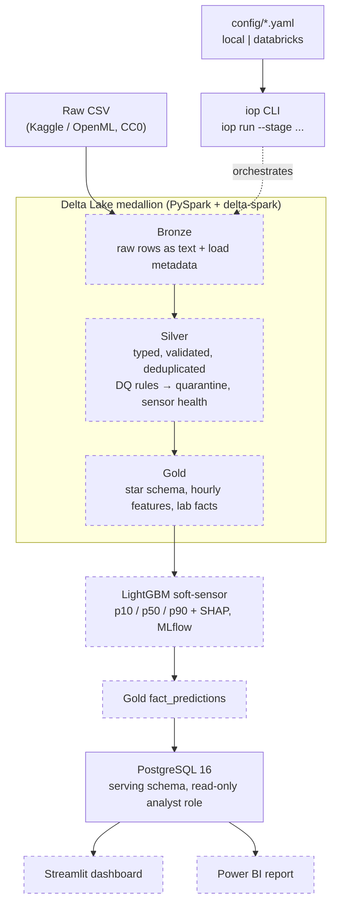

# Industrial Operations Intelligence Platform (IOP)

**An hourly estimate of silica impurity in iron-ore concentrate, available before the lab result arrives, so operators can correct the process sooner.**

> **Status: early build.** The project skeleton is done: repo layout, config, CLI, Docker, CI and a Spark + Delta smoke test. Data profiling has started. The pipeline stages exist only as stubs so far. See [Roadmap](#roadmap) for what's still to come.

---

## The problem

In a flotation plant, silica is the impurity that decides whether iron-ore concentrate meets spec. The lab measures it roughly **once an hour**. Between results, operators adjust reagents, pulp flow, and column air and level without seeing the quality they're producing. When a result comes back off-spec, an hour or more of product has already been made.

This project uses the plant's **20-second process sensor data** to estimate each hour's % silica before the lab assay arrives. The estimate comes with an uncertainty band and the process variables that drive it. It also tracks data and sensor health, because the estimate is only as good as the data behind it.

## Architecture

Solid boxes exist in the repo today. Dashed boxes are planned.



**Built today:** the `iop` CLI with all eight stages registered (each one a stub that returns a `StageResult`), typed config loading for local and Databricks modes, one Spark session builder shared by both modes, and a PostgreSQL 16 container in Docker Compose (no schema yet).

The same stage functions (`run(spark, cfg) -> StageResult`) are meant to run locally and on Databricks Free Edition. Only the config file changes between the two.

## Tech stack

The table lists only what the current code and tooling actually use.

| Area | Tools |
|---|---|
| Language | Python 3.11 |
| Processing / storage | PySpark 3.5.3, delta-spark 3.2.1 (pinned together) |
| Config | YAML + Pydantic models (`src/iop/config.py`) |
| Serving DB | PostgreSQL 16 (Docker Compose service) |
| Testing / linting | pytest, ruff |
| DevOps | Docker, Docker Compose, Makefile, GitHub Actions |
| Cloud target | Databricks Free Edition (`config/databricks.yaml`; not run there yet) |

LightGBM, XGBoost, scikit-learn, SHAP, MLflow, SQLAlchemy/psycopg and Streamlit are declared in `pyproject.toml`, but no code uses them yet. See [Roadmap](#roadmap).

## Data

- **Dataset:** *Quality Prediction in a Mining Process* by Eduardo Magalhães Oliveira. Available on [Kaggle](https://www.kaggle.com/datasets/edumagalhaes/quality-prediction-in-a-mining-process) and mirrored on [OpenML (ID 43311)](https://www.openml.org/d/43311).
- **Licence:** CC0 Public Domain.
- **Content:** real flotation-plant data from March to September 2017. It includes feed quality, reagent flows, pulp properties, 7 flotation columns (air flow and level), and lab assays of % iron and % silica in the concentrate.
- **Target:** `% Silica Concentrate`.

### What profiling found so far

These findings come from [`docs/findings.md`](docs/findings.md).

| Trap | Finding | How it's handled |
|---|---|---|
| Decimal commas | Confirmed. Values are quoted like `"55,2"`. | Parse commas explicitly. Never let the CSV reader guess types. |
| Hour-only timestamps | Confirmed. About 174–180 rows share each timestamp, across 4,097 distinct hours. | Aggregate to hourly features. Never invent sub-hour timestamps. |
| Hourly lab values repeated or interpolated | Confirmed, and more nuanced than expected. 92.4% of hours have one silica value. **310 hours (7.6%)** have many distinct values, scattered across the whole period. | Flag these hours as interpolated and exclude them from training targets, evaluation and lag features ([D06](docs/decisions.md)). |
| Gaps / partial hours | Partly confirmed. The first hour is partial (174/180 rows). The full gap inventory is still pending. | Hours below 80% completeness are excluded from training ([D03](docs/decisions.md)). Long gaps are never interpolated across. |
| Leakage via `% Iron Concentrate` | Not yet confirmed | Excluded from features except in the ablation, and enforced by a leakage test (planned). |
| Strong persistence baseline | Not yet confirmed | Every model must beat "same as last hour" on MAE. |
| Inflated published scores (random splits) | Not yet confirmed | Time-based splits only ([D05](docs/decisions.md)). |

## Results

The metrics table is generated from `reports/metrics.json`, never typed by hand.

<!-- METRICS:START -->
Metrics generated after final evaluation.
<!-- METRICS:END -->

### Leakage ablation

This table will compare test-period MAE with and without `% Iron Concentrate`, and with a time-based split versus a random split. It will be generated from `reports/metrics.json` once `ml/ablation.py` and the final evaluation run.

| Setup | Split | Uses `% Iron Concentrate` | MAE |
|---|---|---|---|
| Honest model | Time-based | No | _pending_ |
| Leaky feature | Time-based | Yes | _pending_ |
| Leaky split | Random | No | _pending_ |

## How to run

### Local (Docker)

Spark and Delta run inside the `app` container on Linux, which avoids the Windows `winutils.exe` problem. You need Docker and Docker Compose.

```bash
make setup      # build the app image (Python 3.11 + JDK + package)
make test       # pytest inside the container (Spark + Delta smoke test)
make lint       # ruff check + ruff format --check
make up         # start PostgreSQL 16 in the background
make pipeline   # iop run --stage all --config config/local.yaml (stages are stubs today)
make down       # stop everything
```

To run a single stage:

```bash
docker compose run --rm app python -m iop.cli run --stage build_silver --config config/local.yaml
```

Available stages: `ingest_bronze`, `build_silver`, `dq_checks`, `build_gold`, `train_or_load_model`, `score_predictions`, `export_serving`, `refresh_reports`, `all`.

**Raw data:** download the CSV from Kaggle and set `paths.raw_csv` in `config/local.yaml` to a path the container can see.

**CI:** GitHub Actions (`.github/workflows/ci.yml`) runs ruff and pytest on every push and pull request that touches this project.

### Databricks Free Edition

The Databricks run mode is configured but hasn't been run yet.

- `config/databricks.yaml` points to a Unity Catalog volume (`/Volumes/workspace/landing/ore_prediction/...`), the `workspace` catalog with `bronze` / `silver` / `gold` schemas, and MLflow tracking set to `databricks`.
- In Databricks mode, `iop.spark.get_spark` reuses the active session, so stage code doesn't branch on where it runs.
- Planned: a Databricks Job with one task per stage, each calling `iop run --stage <name> --config config/databricks.yaml`. The job definition (`databricks/job.json`) doesn't exist yet.

## Repo structure

```
industrial-operations-intelligence/
├── CLAUDE.md              # project rules for Claude Code
├── Makefile               # setup | test | lint | pipeline | dashboard | up | down
├── Dockerfile             # Python 3.11 + JDK for PySpark
├── docker-compose.yml     # postgres:16 + app container
├── pyproject.toml         # pinned deps, `iop` entry point, ruff/pytest config
├── config/
│   ├── local.yaml         # local paths, split dates, lab delay, thresholds
│   ├── databricks.yaml    # Unity Catalog + Databricks MLflow
│   ├── dq.yaml            # data-quality ranges, sensor-health and completeness thresholds
│   └── features.yaml      # sensor list, aggregates, lags, excluded features
├── src/iop/
│   ├── cli.py             # iop run --stage ... (stage registry + ordering)
│   ├── config.py          # Pydantic config models
│   ├── spark.py           # one SparkSession builder for both modes
│   ├── models.py          # StageResult
│   ├── ingest/bronze.py   # stub
│   ├── transform/         # silver.py, gold.py (stubs)
│   ├── quality/runner.py  # stub
│   ├── ml/                # train.py, score.py (stubs)
│   ├── serving/export.py  # stub
│   └── reports.py         # stub
├── tests/
│   ├── test_smoke.py      # Spark + Delta write/read round-trip
│   └── data/sample.csv    # 720-row sample of the raw file
├── docs/
│   ├── spec.md            # full build specification
│   ├── decisions.md       # owner design decisions (D01–D06)
│   └── findings.md        # profiling findings
└── .github/workflows/ci.yml
```

`dashboard/`, `database/`, `notebooks/`, `reports/` and `scripts/` exist but are empty for now.

## Design decisions

Real design choices are made by the owner and recorded with the options considered in [`docs/decisions.md`](docs/decisions.md). So far:

- **D01:** lab delay = 1 hour
- **D02:** three 8-hour shifts starting at 06:00
- **D03:** hours below 80% completeness are excluded from training
- **D04:** off-spec means silica above the 75th percentile of the training data
- **D05:** time-based split: train March–June, validate July, test August–September
- **D06:** 310 interpolated lab hours are flagged and excluded

## Roadmap

These components aren't built yet. Each one is a stub or has no code so far.

- [ ] **Profiling notebook** (`notebooks/01_profiling.ipynb`): finish the gap inventory, the iron-concentrate correlation, the persistence baseline and the published-score audit
- [ ] **Bronze ingest:** all columns kept as strings, plus load metadata
- [ ] **Silver:** decimal-comma parsing, DQ rules with a quarantine table, sensor-health flags, and an interpolated-lab flag (DQ10)
- [ ] **Gold:** star schema and hourly features with idempotent Delta MERGE
- [ ] **ML:** leakage test (`tests/test_leakage.py`), persistence and Ridge baselines, a LightGBM quantile model (p10/p50/p90), an XGBoost comparison, SHAP, MLflow, walk-forward CV and a horizon study
- [ ] **Evaluation:** a single final test-period run writing `reports/metrics.json`, plus the leakage ablation (`ml/ablation.py`)
- [ ] **`scripts/build_readme.py`:** fill the metrics block above from `reports/metrics.json`
- [ ] **Serving:** PostgreSQL schema and roles (`database/schema.sql`, `roles.sql`) and an upsert export
- [ ] **Dashboard:** Streamlit app (`dashboard/app.py`) with a replay control over the test period, deployed publicly
- [ ] **Power BI** report on the serving tables
- [ ] **Databricks Job** (`databricks/job.json`) with matching local and cloud row counts
- [ ] **Monitoring** (rolling MAE, PSI) and a scale test (`scripts/scale_test.py`)
- [ ] Demo video
